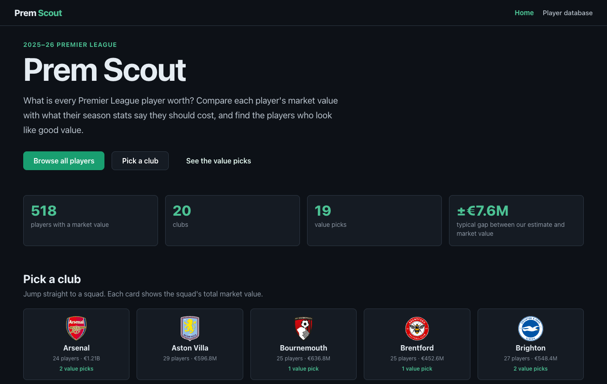
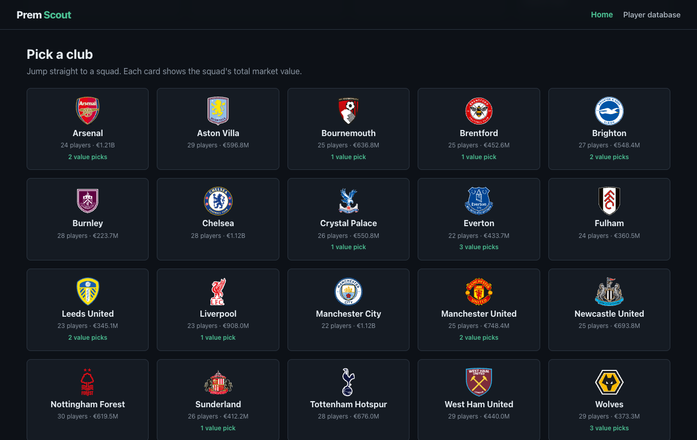
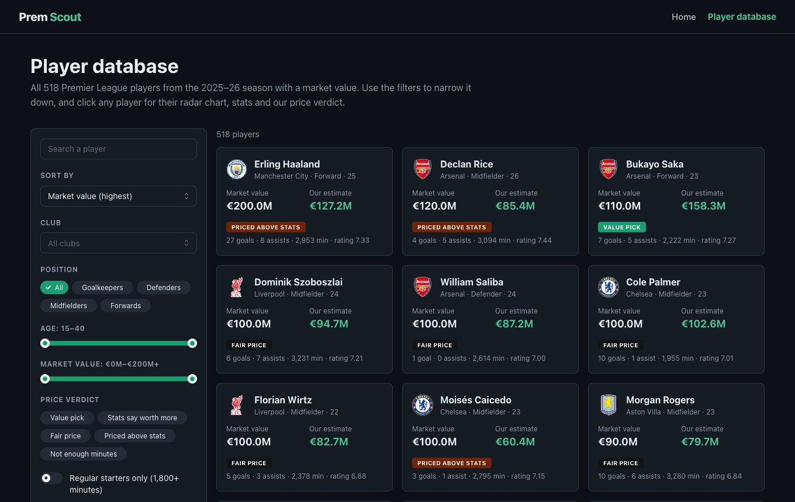
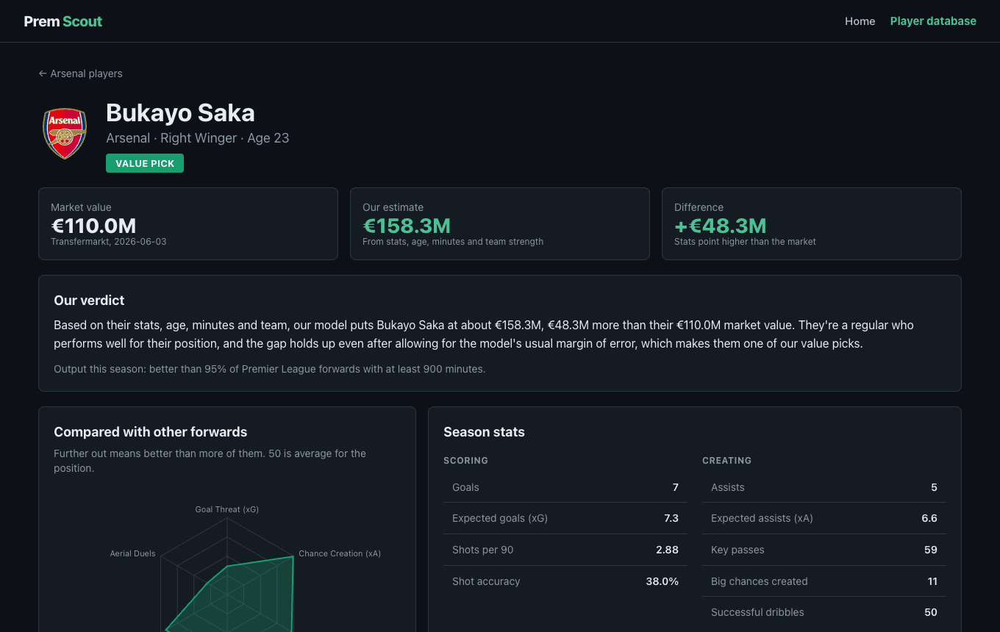
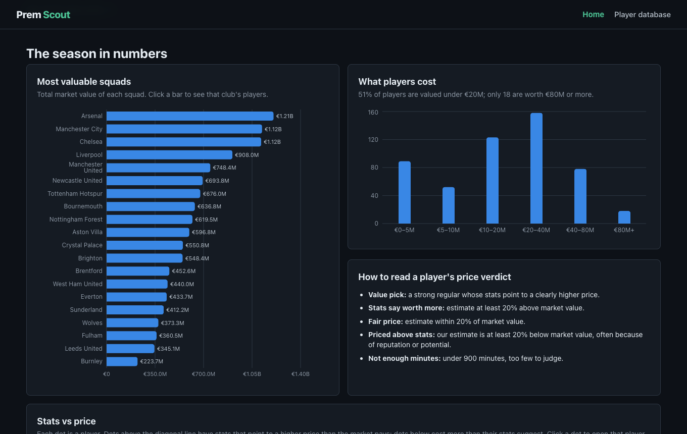

# Prem Scout

**What is every Premier League player worth?** Prem Scout compares each player's market value with what their 2025–26 season stats say they should cost, and picks out the players who look like good value.

**Built by [Arnav Thorat](https://github.com/arnavt16)** · **Live site:** [prem-scout-three.vercel.app](https://prem-scout-three.vercel.app)



## What you can do

- **Browse all 518 players** from the 2025–26 Premier League season who have a market value, as cards you can filter by club, position, age, price and verdict, and sort by value, goals, xG, rating and more.
- **Pick a club** from a grid of all 20 crests to see that squad.
- **Open any player** for their market value, our estimate, a plain-English verdict, a radar chart against players in the same position, their season stats, what drove their estimate, and the players who play most like them.
- **See the season in numbers:** the most valuable squads, how player prices are spread, and every player's stats plotted against their price.

| Pick a club | Player database |
|---|---|
|  |  |

| Player profile | Season charts |
|---|---|
|  |  |

## How it works

1. **Collect the season.** Stats for every Premier League player: goals, expected goals (xG), expected assists (xA), passing, dribbling, defending and match ratings, plus each player's Transfermarkt market value.
2. **Learn what drives prices.** A model learns how stats, age, minutes played and team strength line up with market values across the league.
3. **Estimate every player.** Each player's estimate comes from a version of the model that never saw their own price, so it can't simply copy the answer.
4. **Give a verdict.** Every player gets one of five labels:

| Verdict | Meaning |
|---|---|
| **Value pick** | A regular starter (1,800+ minutes) who performs well for their position, and whose stats point to a clearly higher price, even after allowing for the model's usual error |
| **Stats say worth more** | Our estimate is at least 20% above their market value |
| **Fair price** | Our estimate is within 20% of their market value |
| **Priced above stats** | Our estimate is at least 20% below their market value, often because of reputation or potential |
| **Not enough minutes** | Under 900 minutes, too few to judge |

Profiles also explain each estimate by theme (age, scoring, creating chances, passing, defending, team results and so on), showing roughly how much each one raised or lowered the price.

## Does it work?

**It's good at telling the best players from the rest.** Estimates are typically within about €7.6M of a player's market value, and the model explains about 78% of the differences in price between Premier League outfield players.

**It couldn't beat the market.** The estimates were made in June 2026, before the summer transfer window, so they could be checked against the fees clubs actually paid for the 40 players who moved for a reported fee. Market values predicted those fees better than the model did, and players the model rated above their price didn't sell for bigger premiums than anyone else.

So value picks are players worth a closer look, not guaranteed bargains. The details are in [Summer 2026 transfer check](#summer-2026-transfer-check).

## Where the data comes from

| Source | Covers | Used for |
|---|---|---|
| [FBref](https://fbref.com) | Big-5 leagues, 2025–26, full season | Minutes, team strength, goalkeeper stats, identity |
| SofaScore (Kaggle export) | Premier League, 2025–26, up to matchday 35 of 38 | xG, xA, passing, dribbling, duels, match ratings |
| Fantasy Premier League ([vaastav archive](https://github.com/vaastav/Fantasy-Premier-League)) | Premier League, 2025–26, full season | Extra performance stats, dates of birth for identity checks |
| Transfermarkt ([dcaribou/transfermarkt-datasets](https://github.com/dcaribou/transfermarkt-datasets)) | Market values up to 11 June 2026 | What the model learns to estimate |
| Wikipedia and the Premier League's transfer list | Summer 2026 transfers | Checking the model against real fees only, never for training |

The raw files aren't included in this repo; see [Running it yourself](#running-it-yourself).

---

## Under the hood

The rest of this README is for developers and anyone who wants the full method.

### Tech stack

| Part | Technology |
|---|---|
| Data and model | Python, pandas, NumPy, scikit-learn, LightGBM, SHAP |
| API | FastAPI, Pydantic |
| Website | React, Vite, Mantine (custom dark theme), Recharts, React Router |
| Name matching | unidecode, RapidFuzz |
| Tests | pytest (51 tests) |
| Hosting | Vercel, as a static site |

### Architecture

```
Raw CSVs (FBref, SofaScore, FPL, Transfermarkt)
        ↓
Identity matching (birth year + name + club; SofaScore checked against minutes)
        ↓
Cleaning (deduplication, positions, minutes threshold)
        ↓
Features (per-90 SofaScore + FPL stats, age curve, minutes, team strength)
        ↓
Nested cross-validation (Ridge vs two LightGBM variants, chosen per fold)
        ↓
Verdicts, value picks, explanations, similar players
        ↓
FastAPI → static JSON export → React site on Vercel
```

The data is a fixed season snapshot, so the site never calls a live server. `scripts/export_static_api.py` runs every API response through the real FastAPI app and saves it to `frontend/public/data/`, mirroring the URL layout (`/api/players/{id}/similar` becomes `/data/players/{id}/similar.json`). Pages load instantly, and a test fails if the saved files drift from what the API returns.

### Player matching

A name alone isn't an identity, so every source is linked with an independent check:

- **FBref ↔ Transfermarkt:** name plus birth year for every match, with club disambiguation and surname fallbacks in the Premier League. This fixed a real collision: Fulham's Josh King (born 2007) had been assigned Joshua King's (born 1992) €1.2M valuation instead of the correct €25M. Uncertain matches are logged in `backend/data/processed/match_report.md`.
- **SofaScore:** no birth dates, so rows are matched by club and name, and confirmed by minutes. SofaScore's 35-matchday minutes can't exceed full-season FBref minutes beyond stoppage-time differences, and non-exact names must cover at least 60% of them. 511 of 526 rows link, including every player with 900+ minutes (`sofascore_match_report.md`).
- **FPL:** birth year plus name, preferring the same club. 516 of 518 players link. Two same-year name collisions stay unmatched rather than guessed (`fpl_match_report.md`).

| Dataset | Players |
|---|---:|
| FBref Premier League players | 537 |
| Matched to a Transfermarkt valuation | 518 |
| With at least 900 minutes (modelled) | 338 |
| Outfield players used to train the model | 314 |
| Big-5 goalkeepers used to train the keeper model | 113 |

### The model

- **Target:** `log1p(market value in euros)`, since prices are heavily skewed.
- **Outfield features:** 34 SofaScore stats (per-90 xG, xA, key passes, big chances created, dribbles, final-third passes, recoveries, duels, possession lost, plus pass and duel success rates, match rating and finishing over xG); 14 FPL per-90 stats (influence, creativity, threat, bonus points, defensive contribution, and goals conceded and clean sheets while on the pitch); age and distance from a peak age of 25; minutes; position; and team strength.
- **Team strength (`team_ppm`):** the squad's minutes-weighted points per match this season. It measures results, not reputation. The market pays more for a starter at a title contender than for the same output at a relegation side.
- **Never used:** any valuation field, player or club identity, and FPL price, ownership, transfers or form. Those track popularity, which would let market opinion leak into a model meant to judge the market.
- **Outfield players are trained on the Premier League only.** That beat a Big-5 model on Premier League players even with identical stats. **Goalkeepers** use FBref keeper stats plus the same context across the Big 5, because 24 Premier League keepers are too few to train on.

**Nested cross-validation** (`scripts/generate_rankings.py`): five outer folds. Inside each one, Ridge, a shallow LightGBM and a more regularized LightGBM compete over four inner folds on log error, and the winner is refit and scores only the held-out players. Every displayed estimate therefore comes from a model that never trained on that player's price. Ridge currently wins every fold for both groups. Fold membership is saved so tests can check for leakage, and fold models are saved so each explanation describes the exact model behind the estimate.

**Explanations** break each estimate into per-feature contributions (standardized coefficients for Ridge, SHAP for LightGBM). The site sums them into plain-language themes such as Age, Scoring and Passing, and a test checks that the themes add up exactly to the estimate.

**How each input helped** (Premier League outfield, held-out; measured with the same nested CV before each change was kept):

| Version | Change | R² | Avg. error |
|---|---|---:|---:|
| v2 | FBref per-90 box scores, age, minutes (Big 5) | 0.337 | €13.77M |
| v3 | + team strength, league flags, age curve | 0.643 | €9.67M |
| – | v3 features, Premier League only | 0.698 | €9.14M |
| v4 | SofaScore stats + context, Premier League only | 0.768 | €7.90M |
| **v5** | **+ FPL season stats (current)** | **0.780** | **€7.64M** |

Team strength was the biggest single gain. Playing-time shares and player-level on/off stats were tested and dropped: they added nothing, or nothing beyond squad points per match. FPL's gain is smaller, so it was checked across five different fold splits, and it lowered the error in every one (about €0.3M on average).

**Current results** (`backend/model/artifacts/screening_metrics.json`):

| Group | Players | R² | Avg. error |
|---|---:|---:|---:|
| Premier League outfield | 314 | 0.780 | €7.64M |
| All goalkeepers (Big 5) | 113 | 0.744 | €3.56M |
| Premier League goalkeepers | 24 | 0.824 | €3.98M |

### Value picks

A value pick must pass every check:

1. A verified identity, at least 1,800 minutes and a market value of at least €1M.
2. At least the 50th percentile for **production** among players in the same position.
3. A **cautious estimate** above the market value. The cautious estimate subtracts the 80th percentile of the model's overestimates on training players, so a pick only qualifies if the gap survives the model's usual error. It sits below the market value for 80.3% of players, which describes the buffer overall, not how precise the picks are.
4. An outfield player. Goalkeepers are excluded because their validation rests on 24 players.

**Production** combines SofaScore's match rating with role-specific stats: tackles, interceptions, aerial duels, passing volume and ground-duel win rate for defenders; xA, key passes, final-third passes, dribbles, recoveries and tackles for midfielders; xG, goals, xA, key passes and dribbles for forwards. Passing volume is in the defender score so it doesn't only reward defenders on teams that spend the game without the ball. Rates are shrunk toward the position median by `minutes / (minutes + 900)` before ranking. The thresholds are transparent rules, not tuned values.

The **similar players** search compares players in the same position on 13 per-90 style stats, robust-scaled against their peers, using cosine similarity. Price and age are left out, so cheaper players with a similar style can appear.

### Summer 2026 transfer check

`scripts/evaluate_transfers.py` compares the June 2026 estimates with fees paid in the summer 2026 window, which the model never saw. It uses the 40 modelled players who made permanent moves with a reported fee, taken from Wikipedia's *List of English football transfers summer 2026* and cross-checked against the Premier League's official transfer list (37 of 40 confirmed). Free and undisclosed fees are excluded, and pounds convert at £1 = €1.17.

| Test | Market value | Model estimate |
|---|---:|---:|
| Median fee as a multiple of it | 1.26× | 1.52× |
| Log error vs fee, after removing each one's typical premium | **0.27** | 0.36 |
| Rank correlation with fee | **0.91** | 0.81 |

The model's gap didn't predict which players sold above their market value (Spearman 0.10, bootstrap 90% interval −0.18 to 0.37). Players it rated above their price sold for a median 1.20× their market value; players it rated below, 1.26×. Forty deals is a small sample, and fees also reflect contract length, the selling club's leverage and which players clubs chose to trade. So this is evidence against the value signal, not proof it can never work. Results are in `backend/model/artifacts/transfer_validation.json`.

### API

| Endpoint | Returns |
|---|---|
| `GET /api/players` | All players (filterable and sortable) |
| `GET /api/players/{id}` | Player detail with radar percentiles and SofaScore stats |
| `GET /api/players/{id}/explanation` | Contributions behind the estimate, per feature and by theme |
| `GET /api/players/{id}/similar` | Most similar players in the same position (`limit`, default 5) |
| `GET /api/rankings` | Value picks, best first |
| `GET /api/clubs`, `GET /api/positions` | Filter options |
| `GET /api/model/metrics` | Model results, data sources and the transfer check |

### Project structure

```
Prem-Scout/
├── backend/
│   ├── app/
│   │   ├── main.py           # FastAPI app
│   │   ├── api/              # routes
│   │   ├── schemas/          # Pydantic response models
│   │   ├── services/         # data loading, explanations, similar players
│   │   └── utils/            # features, matching, verdict rules, radar
│   ├── data/
│   │   ├── raw/              # source files (not committed)
│   │   └── processed/        # matched and engineered datasets, match reports
│   ├── model/artifacts/      # fold models, metrics, rankings, transfer check
│   ├── scripts/              # the reproducible pipeline
│   └── tests/
├── frontend/
│   ├── public/data/          # static JSON export the site reads
│   └── src/
│       ├── pages/            # Home, Players, PlayerProfile
│       ├── components/       # cards, filters, charts, explanations
│       └── utils/            # clubs, verdicts, formatting, chart colours
├── notebooks/01_eda.ipynb    # exploratory analysis
└── docs/screenshots/
```

### Running it yourself

Requirements: Python 3.12+ and Node.js 20+.

```bash
# Website only (uses the committed data export; no backend needed)
cd frontend
npm install
npm run dev                  # http://localhost:5173

# Backend and pipeline
cd backend
python3.12 -m venv .venv
source .venv/bin/activate
pip install -r requirements.txt
uvicorn app.main:app --reload --port 8000   # optional: the API at http://127.0.0.1:8000/api
```

To rebuild everything from raw data, place these files in `backend/data/raw/`:

| File | Where to get it |
|---|---|
| `players_data-2025_2026.csv` | FBref Big-5 2025–26 season stats (standard, shooting, keeper, playing time and misc tables) |
| `players.csv`, `player_valuations.csv` | [dcaribou/transfermarkt-datasets](https://github.com/dcaribou/transfermarkt-datasets) |
| `sofascore_pl_2025_26_md35.csv` | Kaggle, published as `premier_league_complete_stats_until35thGameDayOnSeason2025-26.csv` |
| `fpl_2025_26_players_raw.csv`, `fpl_2025_26_teams.csv` | `data/2025-26/players_raw.csv` and `teams.csv` from [vaastav/Fantasy-Premier-League](https://github.com/vaastav/Fantasy-Premier-League) |
| `wikipedia_english_transfers_summer_2026.csv` | The permanent-transfers table from Wikipedia's *List of English football transfers summer 2026* |
| `premier_league_summer_2026_moves.csv` | The Premier League's summer 2026 transfer list (player, club, move type, other club) |

Then run, from `backend/` with the virtual environment active:

```bash
python scripts/match_players.py           # FBref ↔ Transfermarkt (Premier League)
python scripts/build_training_set.py      # extends matching to the other Big-5 leagues
python scripts/clean_data.py              # deduplication, positions, minutes flag
python scripts/match_sofascore.py         # SofaScore ↔ players, checked against minutes
python scripts/match_fpl.py               # FPL ↔ players, checked against birth year
python scripts/engineer_features.py       # per-90 and context features
python scripts/train_baseline.py          # diagnostic baselines
python scripts/train_lightgbm.py          # diagnostic full-fit LightGBM
python scripts/select_champion_models.py  # diagnostic model comparison
python scripts/generate_rankings.py       # nested CV, fold models, verdicts, value picks
python scripts/evaluate_transfers.py      # summer 2026 fee check
python scripts/export_static_api.py       # static JSON for the website (run last)
```

Every script is deterministic and prints its own checks. Run `evaluate_transfers.py` before `export_static_api.py`, because the export includes the transfer check.

### Tests

```bash
cd backend
pytest tests/ -v
```

The 51 tests cover identity collisions and missing birth years, value-pick rules, fold separation (no player is scored by a model that trained on them), explanations that add up to the displayed estimates, similar players, API filtering and sorting, and the static export matching the API.

### Deployment

The site is a static Vite build. On Vercel, import the repository, set the root directory to `frontend`, and deploy; no environment variables are needed. `frontend/vercel.json` sends page routes to the app but leaves `/data/` alone, so a missing file returns a real 404. To publish new data, rerun the pipeline and push the updated `frontend/public/data/`.

The FastAPI backend isn't needed for the site. `render.yaml` defines an optional Render service if you want to host the API.

## Limitations

- **One season.** The model learns from 314 outfield players. Training on several past seasons of stats and later prices is the most promising improvement.
- **Stale valuations.** The Transfermarkt dataset has stopped updating, so market values end at June 2026.
- **SofaScore stats stop at matchday 35.** Minutes and team strength cover the full season.
- **The value signal failed its first real test** against summer 2026 fees (see above).
- **No injuries, wages or contracts**, all of which affect real prices.
- **Goalkeeper estimates rest on few players** and are rougher than outfield ones.
- **Matching is inferred.** Birth-year and minutes checks prevent known mistakes, but can't prove every identity.
- **Data reuse.** The public site shows figures derived from SofaScore and FPL, whose terms don't clearly allow republishing. That's fine for a non-commercial portfolio project, but not for commercial use. Club crests are loaded from the Premier League's image server and belong to their clubs; this project isn't affiliated with the Premier League.

Market values are not transfer fees or asking prices, and this is a look back at one season, not a forecast.

## License

MIT
